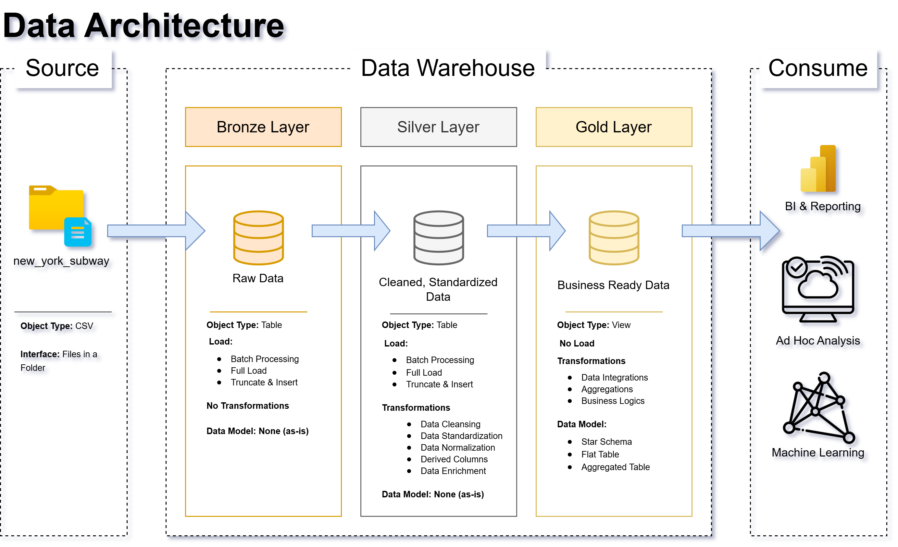
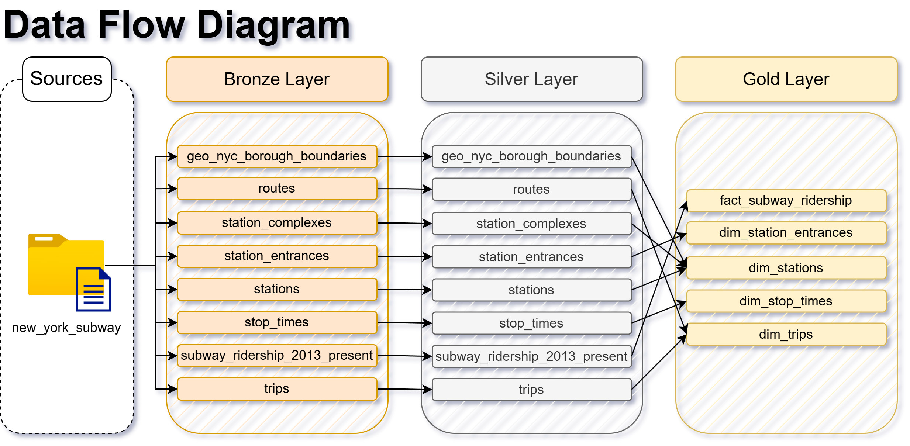
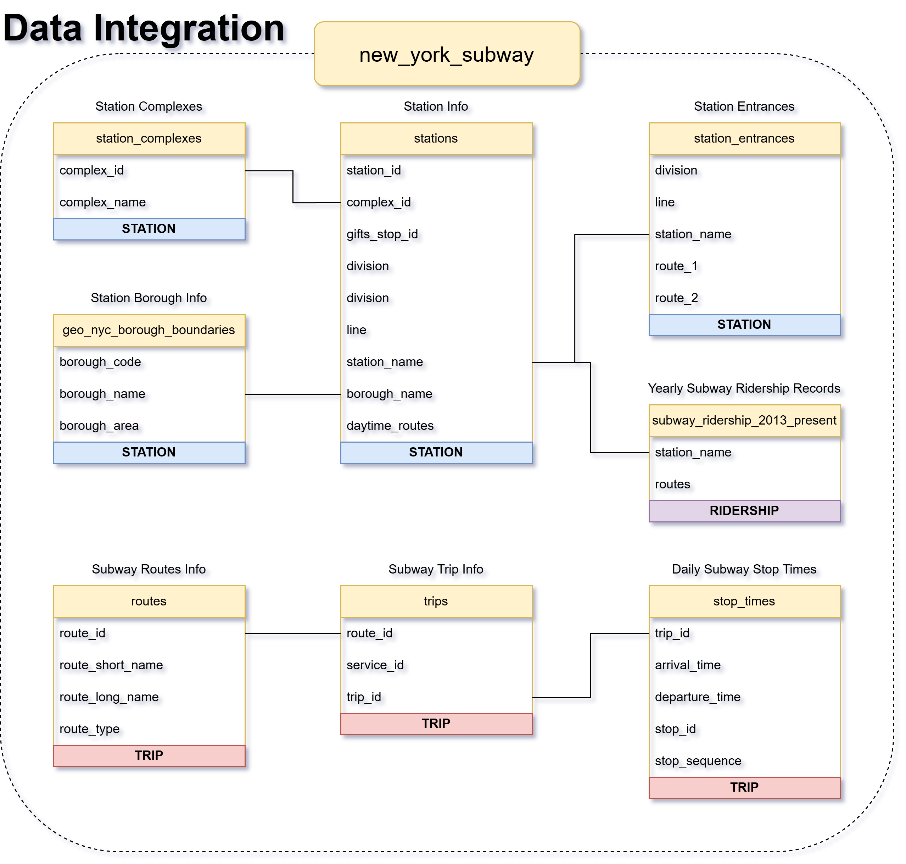

# New York Subway
Welcome to the **New York Subway Data Warehouse repository**.
This project demonstrates a comprehensive data warehousing and analytics solution, from building a data warehouse to generating actionable insights. It highlights industry best practices in data engineering and analytics.
A modern data warehouse with SQL Server, including ETL processes, data modelling, and analytics.

---

## Table of Contents

---

## Project Overview
1. **Data Architecture** - Designing a data warehouse using the **Medallion Architecture** (Bronze, Silver, and Gold Layers).
2. **ETL Pipelines** - Extracting, transforming, and loading structured data.
3. **Data Modelling** - Developing interconnected fact and dimension tables, optimizing for querying and analytics.
4. **Analytics & Reporting** - Creating SQL-based reports and dashboards for actionable insights.

---

## Project Requirements

### Objective
Develop a modern data warehouse using SQL Server to consolidate sales data, enabling analytical reporting and informed decision-making.

### Specifications
- **Data Sources:** - Import data from the new_yorK_subway dataset on **BigQuery**, provided as CSV files.
- **Data Quality:** - Cleanse and resolve data quality issues prior to analysis.
- **Integration:** - Combine the data files to create a user-friendly data model for analytical queries.
- **Scope:** - Focus on the latest dataset only, historization of data is not required.
- **Documentation:** - Provide clear data model documentation to support both business stakeholders and analysis teams.

  ---

## Data Architecture
The data architecture for this project follows the **Medallion Architecture** (Multi-hop Architecture), which consists of the **bronze**, **silver**, and **gold** layers. This type of structure involves making incremental improvements to the data quality as it flows through each layer of the architecture. The setup for this project is shown below:

**Bronze Layer:** 🥉
- The raw data is stored as-is from the source systems.
- Data is extracted from the CSV files (source object type) and entered into the SQL Server database.

**Silver Layer:** 🥈
- Includes data cleansing, standardization, and normalization processes.
- Preparation phase prior to data analysis.

**Gold Layer:** 🥇
- Holds all of the business-ready data modelled into a star schema for reporting and analytics.

---

## Data Flow

The diagram above shows the path the data takes moving from the source folder to the gold layer, where business-ready data can be used for visualization and analysis. Note that most of the rearrangement occurs between the silver and gold layers, where the data model is created through fact/dimension categorization and grouping. More on this topic below.

---

## Data Integration

The diagram above shows all the relationships discovered between the data tables. The data can be split up into 3 different groups (station, trip, and ridership).

--- 

## Important Links and Tools

- **[Dataset](/dataset/):** Access to the project files (CSV format).
- **[SQL Server Express](https://www.microsoft.com/en-us/sql-server/sql-server-downloads):** Server to host the SQL database.
- **[SQL Server Management Studio (SSMS)](https://learn.microsoft.com/en-us/ssms/download-sql-server-management-studio-ssms?view=sql-server-ver16):** GUI used for managing and interacting with the database.
- **[GitHub](https://github.com/):** Storage for all files, queries, and related project documents.
- **[Draw.io](https://www.drawio.com/):** Designing data architecture, flow/integration diagrams, and other visuals.
- **[Notion Page](https://www.notion.com/):** Project Planning and Management Tool. Click **[here](https://www.notion.so/New-York-Subway-Data-Warehouse-1d547ae651ed80b1a855eca1e936898c?pvs=4)** to access the Project Plan.

  
